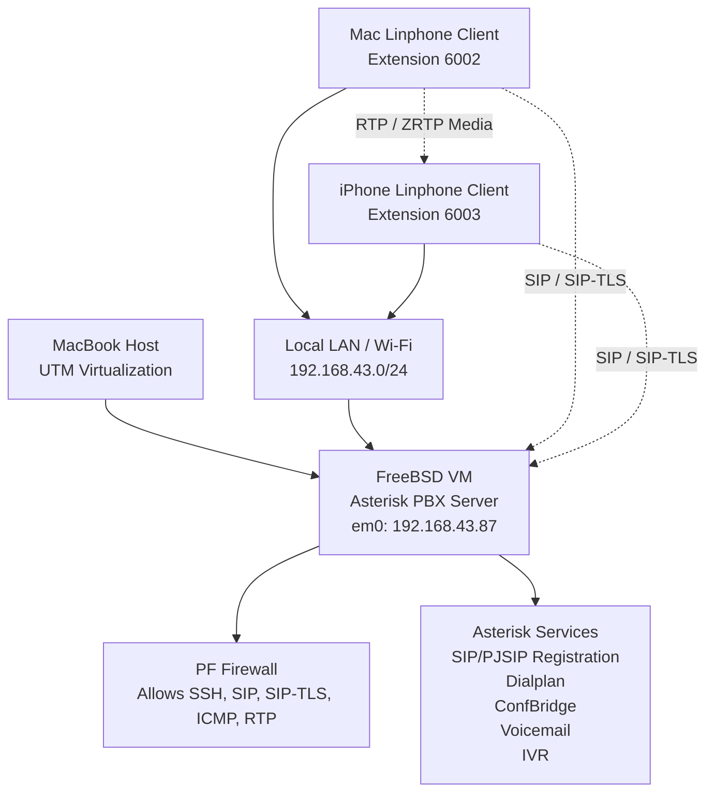

# 📞 FreeBSD + Asterisk VoIP Lab Topology

This diagram shows the network topology used in the FreeBSD + Asterisk VoIP lab.

---

## 🔍 Topology Explanation

The lab used a FreeBSD virtual machine running inside UTM as the VoIP server.  
Asterisk PBX was installed on FreeBSD and used for SIP/PJSIP registration, call routing, voicemail, IVR, and conference calling.

Linphone softphones were configured on a Mac and an iPhone. Both clients connected to the Asterisk server through the local LAN.

---

## 🔐 Security Components

- PF firewall was used to control allowed traffic.
- SIP-TLS was configured for secure SIP signalling.
- ZRTP was used for end-to-end media encryption.
- RTP media ports were controlled through firewall rules.

---

## 📌 Key Network Details

| Component | Details |
|---|---|
| VoIP Server | FreeBSD VM running Asterisk PBX |
| Virtualization | UTM |
| Server IP | 192.168.43.87 |
| Network Mode | Bridged LAN |
| Softphone Clients | Linphone on Mac and iPhone |
| Test Extensions | 6002 and 6003 |
| SIP | UDP 5060 |
| SIP-TLS | TCP 5061 |
| RTP Media Range | UDP 10000-20000 |
| Media Encryption | ZRTP |
