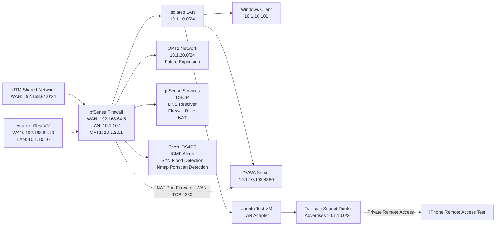

# 🔥 pfSense Firewall and Network Security Lab Topology

This diagram shows the network topology used in the pfSense Firewall and Network Security lab.

---

## 🔍 Topology Explanation

The lab used **pfSense** as a virtual firewall inside **UTM**.  
pfSense separated the upstream WAN network from the isolated internal LAN used for client connectivity and controlled security testing.

The WAN interface received an address from the UTM shared network.  
The LAN interface worked as the gateway for the isolated internal network.  
The OPT1 interface was available for future network expansion.

The Windows client was used for LAN connectivity, DHCP, DNS, and browsing tests.  
The DVWA server was used for controlled web security testing.  
The Ubuntu test VM was used for security testing and remote access support.  
Snort IDS/IPS was configured on pfSense to detect suspicious traffic such as SYN flood attempts and Nmap port scans.

---

## 🔐 Security Components

This topology includes the following security components:

- pfSense firewall for network traffic control
- LAN and WAN separation
- OPT1 network for future segmentation
- DHCP and DNS services for internal clients
- Firewall rule-based website blocking
- NAT port forwarding for controlled DVWA access
- Snort IDS/IPS monitoring
- Controlled SYN flood detection
- Controlled Nmap port scan detection
- OpenVPN remote access preparation
- Tailscale subnet routing for private remote access testing

---

## 📌 Key Network Details

| Component | Details |
|---|---|
| Firewall | pfSense |
| Virtualization | UTM |
| WAN Network | 192.168.64.0/24 |
| pfSense WAN | 192.168.64.5/24 |
| pfSense LAN Gateway | 10.1.10.1/24 |
| pfSense OPT1 | 10.1.20.1/24 |
| Windows Client | 10.1.10.101 |
| DVWA Server | 10.1.10.103:4280 |
| Attacker/Test VM | 192.168.64.10 / 10.1.10.10 |
| IDS/IPS | Snort |
| NAT Test | WAN TCP 4280 forwarded to DVWA |
| Remote Access | OpenVPN preparation and Tailscale subnet routing |

---

## 🧪 Testing Represented in This Topology

This topology supports the following lab tests:

- pfSense installation verification
- WAN, LAN, and OPT interface configuration
- LAN client connectivity testing
- DHCP lease assignment
- DNS resolver testing
- Internet connectivity testing
- Firewall website blocking test
- NAT port forwarding test
- DVWA controlled security testing
- Snort IDS/IPS alert monitoring
- SYN flood detection
- Nmap port scan detection
- OpenVPN server preparation
- Tailscale subnet router remote access testing

---

## ⚠️ Ethical and Safety Note

All testing shown in this topology was performed only inside a controlled virtual lab environment.

No public systems, external targets, or unauthorized networks were tested.
